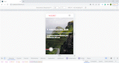

# VIAJES BLOG

**Tecnologías y librerías:**

- Interfaz realizada con **ReactJS - Create React App**
- Ruteo con **React Router Dom**

## Descargar y correr el proyecto

Una vez clonado o descargado el proyecto, instalar dependencias:

### `npm install`

Correr el servidor en modo desarrollo:

### `npm start`

Se abre una pestaña del navegador en el puerto 3000:

### Sino copiar esta URL y pegarla en el navegador: `http://localhost:3000`
